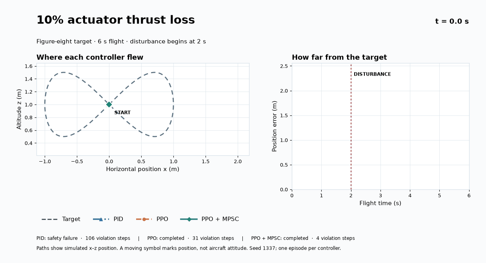
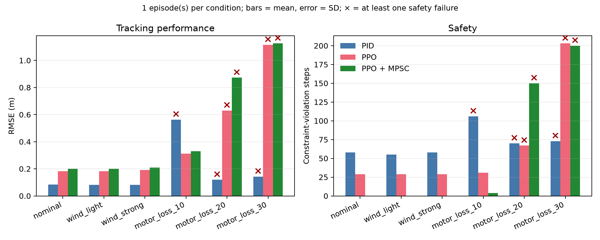

# Safety Assured UAV Tracking under Wind and Actuator Degradation

What happens when a quadrotor loses thrust halfway through a flight? This
reproduction compares three controllers as a simulated 2D quadrotor follows a
figure eight. At two seconds, the environment applies a lateral force or reduces
one motor group's thrust. All runs use the same trajectory and initial state.



The moving symbols mark each controller's **simulated position**, not aircraft
attitude. The dashed target is a figure eight; the actuator fault begins at
**t = 2 s**. [Open the full-resolution static figure](assets/flight_motor_loss_10.svg)
or [compare the 20% loss case](assets/flight_motor_loss_20.svg).

The project builds on
[`safe-control-gym`](https://github.com/learnsyslab/safe-control-gym) at commit
[`6b5391d`](https://github.com/learnsyslab/safe-control-gym/commit/6b5391d014f36fdfa0f9d22d92c77387e5274308).
It uses the upstream simulator, pretrained PPO policy, saved MPSC model, and
PID controller. The experiment runner, disturbance protocol, motor loss model,
metrics, plots, and analysis here are added for this project.

The experiment compares:

1. PID
2. pretrained PPO
3. pretrained PPO with a Linear Model Predictive Safety Certification (MPSC)
   filter

## Controllers and safety method

The upstream CBF safety filter supports cart pole, while its quadrotor example
uses Linear MPSC. MPSC checks PPO's proposed thrust against a model based
prediction and corrects it when needed. This experiment therefore compares
**PID, PPO, and PPO + MPSC**. It does not implement a quadrotor CBF.

## Experiment design

The simulated task lasts six seconds at 50 control steps per second. All
disturbances begin at step 100, two seconds into the flight.

| Scenario | Injected change |
|---|---|
| Nominal | No disturbance |
| Light lateral force | Constant +0.005 N along the x axis |
| Strong lateral force | Constant +0.015 N along the x axis |
| Motor loss 10%, 20%, 30% | Multiply thrust of the first 2D motor group by 0.9, 0.8, or 0.7 |

The lateral force is a **wind proxy measured in newtons**, not a wind speed in
m/s. Translating it into a wind speed needs an airframe drag model. The 2D
actuator represents a motor group; the loss percentages do not describe a
specific physical motor on a real aircraft.

## Results from the reproduced run

One deterministic episode was run for each controller and scenario. These
values establish that the implementation runs and show its failure modes; they
do not estimate crash probabilities.

| Controller | RMSE | Constraint-violation steps | Safety interventions |
|---|---:|---:|---:|
| PPO | 0.182 m | 29 | 0 |
| PPO + MPSC | 0.200 m | 0 | 47 |

In the nominal episode, MPSC removes all 29 constraint violation steps made by
PPO; tracking RMSE rises from 0.182 m to 0.200 m. It modifies PPO's action on
47 steps.

The supplied `results/` directory also contains a single deterministic episode
for every disturbance level. The main observations are:

- all three controllers complete both lateral-force tests;
- PPO + MPSC has zero violations in nominal and lateral-force runs;
- at 10% one-sided motor loss, PPO completes the task with 31 violation steps,
  while PPO + MPSC completes it with 4;
- at 20–30% motor loss, every controller reaches the defined safety-failure
  condition, and the MPSC optimizer is feasible on only 48% and 34% of steps.

At 20% and 30% motor loss, the saved MPSC model frequently cannot find a
feasible solution. Its invariant set was learned near nominal dynamics, so
these larger actuator faults exceed what this particular filter handles in the
experiment.

See [`RESULTS.md`](RESULTS.md) for the complete table and interpretation.



## Run it

Requirements: Apple Silicon macOS, Conda, Git, and an internet connection for
the upstream checkout and package installation. The provided setup pins the
upstream source commit and uses Python 3.11. Training PPO again is **not**
required; the upstream pretrained checkpoint is loaded for evaluation.

```bash
git clone https://github.com/nguyenhuynh110907-ops/uav-safe-rl-reproduction.git
cd uav-safe-rl-reproduction
./setup_macos.sh
./conda311/bin/python reproduce.py --scg-root ./safe-control-gym --output ./results-local
```

For a short run:

```bash
./conda311/bin/python reproduce.py \
  --scg-root ./safe-control-gym \
  --scenarios nominal wind_strong motor_loss_20 \
  --controllers pid ppo ppo_mpsc \
  --output ./results-smoke
```

The default command evaluates all six scenarios with three controllers: 18
episodes. `--show-solver-output` displays IPOPT diagnostics if you want to
inspect infeasible MPSC steps.

To sample different starting states, use `--randomized-init --seeds 11 22 33 44
55`. Interpret the resulting CSV by seed; the included results use only seed
1337 and a fixed initial state.

## Recorded outputs

- `metrics.csv`: one row per controller, scenario, and seed;
- `results.json`: metrics plus trajectories and upstream source commit;
- `trajectory_<scenario>.png`: reference and flown paths;
- `summary.png`: RMSE and constraint violation comparison.

To make a flight replay from any `results.json`, run:

```bash
./conda311/bin/python visualize_flights.py \
  --results ./results-local/results.json \
  --out ./assets-local \
  --scenario motor_loss_10 \
  --gif
```

The command writes an editable SVG, a PNG, and (with `--gif`) an animated GIF.
Use `--scenario motor_loss_20` or another scenario ID for a different replay.
The committed visualizations in `assets/` show seed 1337 from the supplied
deterministic run.

`energy_proxy_n2s` is the integral of squared actuator thrust, not battery
energy. Use it only for relative comparison.

Here, `crash=1` is a conservative safety-failure proxy: the episode terminated
before 300 control steps or altitude reached 0.02 m. A low RMSE from an early
terminated PID run must therefore not be interpreted as good performance; use
the crash flag and completion length together with RMSE.

## Reproducibility and limits

The Python runner applies a local compatibility fix for `pytope==0.0.4` with
NumPy 2. The upstream checkout remains unmodified. The experiment uses
pretrained weights and a saved MPSC invariant set, so it is an evaluation
reproduction with new test disturbances rather than training from scratch.

The included run has one episode per condition. Use more starting states for
performance estimates, and report completion, safety failures, and constraint
violation steps alongside RMSE. The lateral force also needs calibration against
a real airframe before it can represent a particular wind speed.

## Next research step

Use actuator fault detection to trigger a high level contingency decision:
**continue, reroute, return, or land**. Then compare a fixed safety model with
one that adapts its uncertainty set after damage.

For publication-quality claims, run at least 20 randomized seeds, report mean
and confidence intervals, calibrate force to a real airframe's drag model, and
test parameter mismatch (mass/inertia) separately from actuator loss.
