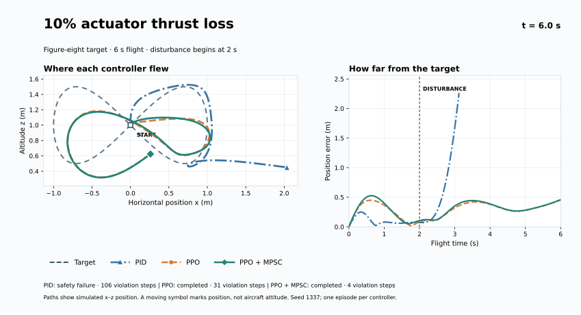
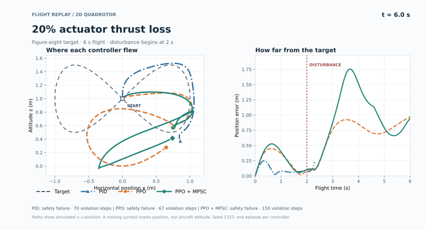

# Reproduced results

These values are from one deterministic episode per condition. They verify the
pipeline and expose useful failure modes; they are not statistical performance
claims.

## Flight paths

The [animated 10% actuator-loss replay](assets/flight_motor_loss_10.gif) shows
the figure-eight target and each controller's simulated x–z position. The
right-hand panel tracks position error; its vertical line marks fault onset at
2 s. Symbols indicate position only, not aircraft attitude.

At 10% loss, PID terminates early; PPO and PPO + MPSC complete the six-second
flight. The safety filter lowers PPO's violation count from 31 to 4 steps.

At 20% loss, all three runs meet the safety-failure criterion. PID's short
track is an early termination, not a successful recovery. These are single
episodes (seed 1337), not typical flight envelopes.

| Scenario | Controller | RMSE (m) | Violation steps | Safety failure | MPSC feasible |
|---|---|---:|---:|:---:|---:|
| Nominal | PID | 0.083 | 58 | No | — |
| Nominal | PPO | 0.182 | 29 | No | — |
| Nominal | PPO + MPSC | 0.200 | 0 | No | 100% |
| Wind, 0.005 N | PID | 0.081 | 55 | No | — |
| Wind, 0.005 N | PPO | 0.182 | 29 | No | — |
| Wind, 0.005 N | PPO + MPSC | 0.200 | 0 | No | 100% |
| Wind, 0.015 N | PID | 0.081 | 58 | No | — |
| Wind, 0.015 N | PPO | 0.192 | 29 | No | — |
| Wind, 0.015 N | PPO + MPSC | 0.209 | 0 | No | 100% |
| Motor loss, 10% | PID | 0.563 | 106 | Yes | — |
| Motor loss, 10% | PPO | 0.313 | 31 | No | — |
| Motor loss, 10% | PPO + MPSC | 0.330 | 4 | No | 98.7% |
| Motor loss, 20% | PID | 0.119 | 70 | Yes | — |
| Motor loss, 20% | PPO | 0.630 | 67 | Yes | — |
| Motor loss, 20% | PPO + MPSC | 0.872 | 150 | Yes | 48.3% |
| Motor loss, 30% | PID | 0.143 | 73 | Yes | — |
| Motor loss, 30% | PPO | 1.115 | 203 | Yes | — |
| Motor loss, 30% | PPO + MPSC | 1.125 | 200 | Yes | 33.7% |

## Interpretation

The nominal run exactly reproduces the upstream safety trade-off: MPSC reduces
PPO's 29 constraint-violation steps to zero, with RMSE changing from 0.182 m to
0.200 m. The same behavior persists under the tested lateral-force proxies.

At 10% one-sided motor loss, both learning-based controllers finish the task.
MPSC reduces violations from 31 to 4, but it modifies the policy action 104
times. PID terminates early.

At 20% and 30% loss, every controller reaches the conservative safety-failure
condition. The MPSC optimization becomes frequently infeasible because its
saved invariant set was learned near nominal dynamics. This is the most useful
finding for a follow-up project: retrain or adapt the uncertainty set, detect
actuator damage, then trigger a contingency decision such as return or land.

The apparently low PID RMSE at 20–30% loss is an artifact of early termination.
Always interpret RMSE with `steps` and `crash` in `results/metrics.csv`.
